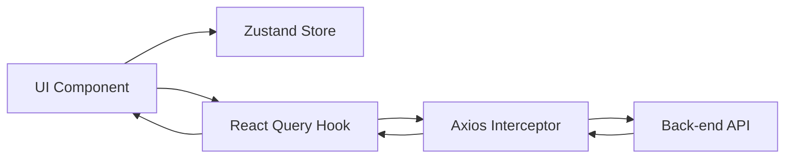

# 🏥 Pharmetix Client (MediStore)

[](https://nextjs.org/)
[](https://tailwindcss.com/)
[](https://zustand-demo.pmnd.rs/)
[](https://tanstack.com/query/latest)

Pharmetix is a high-performance, responsive pharmaceutical e-commerce platform. This repository contains the **Frontend Client**, built with a focus on visual excellence, snappy interactions, and strict role-based security.

---

## 📖 Table of Contents

1.  [Technical Architecture](#-technical-architecture)
2.  [Feature Ecosystem](#-feature-ecosystem)
3.  [User Personas & Journeys](#-user-personas--journeys)
4.  [Core Development Principles](#-core-development-principles)
5.  [Folder Architecture](#-folder-architecture)
6.  [Setup & Configuration](#-setup--configuration)
7.  [Key API Integrations](#-key-api-integrations)

---

## 🏗️ Technical Architecture

The application is architected using a **Feature-Slice Design (FSD) light** approach to ensure high maintainability and scalability.

### Core Stack

- **Framework**: Next.js 16 (App Router) with Server & Client Components.
- **Styling**: Tailwind CSS 4 using a premium design system tokens.
- **State Layer**: Zustand for ultra-lightweight client-side state (Cart, User UI preferences).
- **Caching Layer**: Tanstack React Query for server-state synchronization and optimistic updates.
- **Authentication**: Better Auth with native session management and role extraction.

### Data Flow Model



---

## 🌟 Feature Ecosystem

### 🌐 Public Experience

- **Smart Shop**: List view vs Grid view toggle with persistent preferences.
- **Advanced Taxonomy**: Browse by Therapeutic Category, Generic Name, or Manufacturer.
- **Deep Search**: Debounced search integrated with URL state for bookmarkable result pages.
- **SEO Optimized**: Dynamic metadata and semantic HTML for every pharmaceutical listing.

### 🍱 Customer Suite

- **Cart Engine**: Dynamic calculation of subtotals and stock validation.
- **Frictionless Checkout**: Multi-step form with address validation and COD payment.
- **Dashboard**: Order timeline visualization and simplified status tracking.
- **Verified Reviews**: Community-driven trust system with purchase-locked access.

### 📊 Seller Workspace

- **Analytics KPI**: Sales trends, total revenue, and performance metrics.
- **Stock Control**: Specialized table with inline stock update popovers and rapid-fire increments.
- **Order Pipeline**: Ship-mark individual items and manage order item logistics.

### 🛡️ Administrative Console

- **Platform Health**: Real-time stats on user growth, medicine volume, and revenue.
- **Security Suite**: Ban/Unban mechanism to protect marketplace integrity.
- **Taxonomy Manager**: Master control over categories and therapeutic classes.

---

## 👥 User Personas & Journeys

### 1. The Customer Flow

`Discovery` → `Selection` → `Cart` → `Validation` → `Payment` → `Tracking`

- Uses **Search** to find specific generics.
- Uses **Reviews** to confirm authenticity.
- Uses **Order Tracking** to monitor logistics.

### 2. The Pharmacist Flow (Seller)

`Inventory Setup` → `Stock Monitoring` → `Fulfillment`

- Uses **Stock Alerts** to manage inventory levels.
- Uses **Dashboard** to analyze best-selling medicines.
- Optimistically updates **Stock Levels** during peak hours.

---

## 🛠️ Core Development Principles

1.  **Strict Typing**: 100% TypeScript coverage for all data models and API responses.
2.  **Visual Excellence**: Premium UI using Shadcn/UI components with custom glassmorphism effects.
3.  **Performance First**:
    - Optimistic UI updates for stock changes.
    - Next.js Image optimization for all medicine thumbnails.
    - Prefetching critical routes during hover.
4.  **Security**:
    - Centralized Axios interceptor for JWT/Session attachment.
    - Role-based route protection via Middleware and higher-order layouts.

---

## 📂 Folder Architecture

```text
src/
├── app/               # Next.js App Router (Routes & Layouts)
│   ├── (public)/      # Open routes (Shop, Details, Cart)
│   ├── dashboard/     # Role-based protected shells
│   │   ├── admin/     # Admin-only views
│   │   ├── seller/    # Pharmacist-only views
│   │   └── profile/   # Customer-shared views
├── components/        # UI & Global Shared Components
│   ├── ui/            # Shadcn base components (Tailwind 4)
│   └── shared/        # App-specific shared logic (Data Tables, Headers)
├── features/          # Domain-driven feature slices
│   ├── auth/          # Better Auth hooks and UI
│   ├── medicine/      # Hooks, Services, and Forms for products
│   ├── order/         # Checkout logic and tracking
│   └── category/      # Admin category management
├── hooks/             # Global utility hooks (debounce, hydration)
├── lib/               # Utility functions & Singleton instances (Axios, Prisma)
├── store/             # Zustand store definitions
└── types/             # Global TypeScript interface definitions
```

---

## 🚀 Setup & Configuration

### Installation

```bash
# Clone the project
git clone https://github.com/sheikh-saiyam/pharmetix-client.git

# Enter the directory
cd pharmetix-client

# Install dependencies
pnpm install
```

### Environment Variables

Create a `.env.local` file in the root:

```env
# API Configuration
NEXT_PUBLIC_API_URL="http://localhost:5000/api"

# Auth Configuration (Must match server)
BETTER_AUTH_URL="http://localhost:3000"
NEXT_PUBLIC_BETTER_AUTH_URL="http://localhost:3000"
```

### Development

```bash
pnpm dev
```

The app will be available at `http://localhost:3000`.

---

## 📄 Key API Integrations

The client uses a modular service pattern located in `src/features/*/services/`.

- **Interceptors**: Automatically handles authentication error states (401/403).
- **Query Keys**: Standardized query keys for reliable cache invalidation after mutations.
- **Schema Validation**: All inbound and outbound data is validated against Zod schemas.

---

**Built with pride for Modern Healthcare Platforms.**
