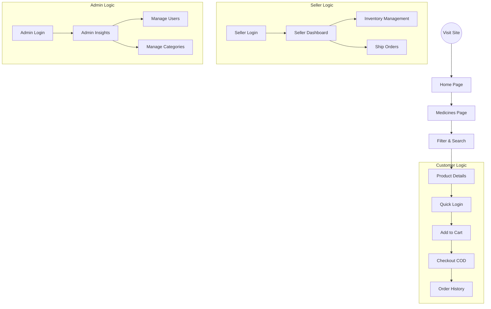
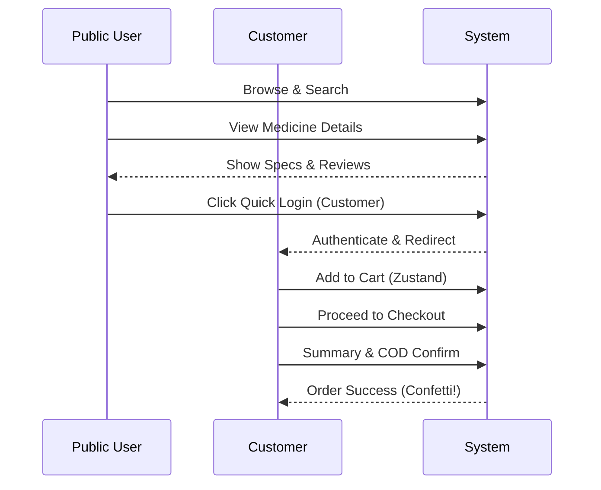
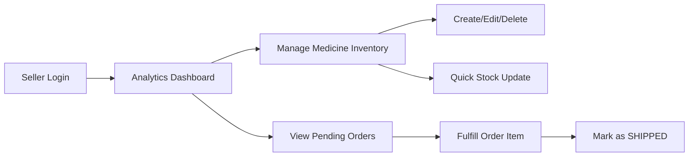
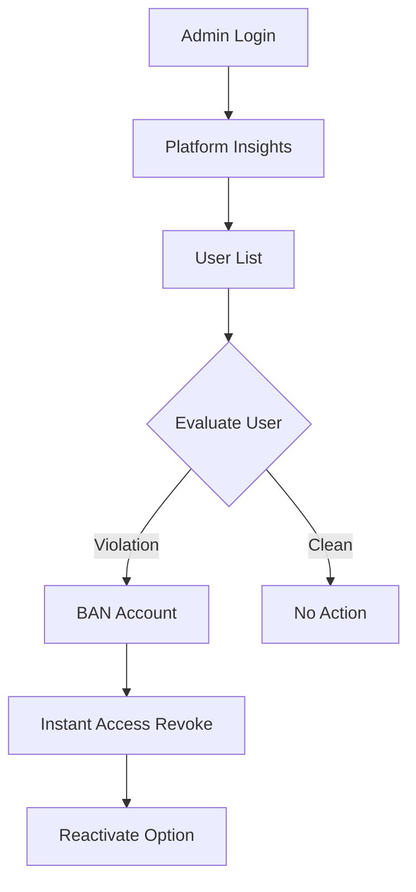

# 🎥 MediStore (Pharmetix) Video Explanation Guide

This guide provides a structured flow for demonstrating the **MediStore** platform.
**Duration:** 5-10 Minutes | **Target Audience:** Project Reviewers / Clients

---

## 🕒 Timestamp Overview

| Phase  | Focus                            | Duration |
| :----- | :------------------------------- | :------- |
| **01** | Intro & Public Features          | 1.5 Mins |
| **02** | Customer Journey (Ordering)      | 2.5 Mins |
| **03** | Seller Workflow (Management)     | 2.0 Mins |
| **04** | Admin Oversight (Security)       | 2.0 Mins |
| **05** | Error Handling & Technical Outro | 1.0 Min  |

---

## 🗺️ Visual Project Map

_Keep this diagram in mind while navigating the site._

---

## 🎬 Part 1: Intro & Public Features (Health First)

**Goal:** Show the visual appeal and ease of use for general users.

1.  **Home Page**: Show the hero section, featured medicines, and recent reviews. Mention the premium design system (Tailwind 4 + Shadcn).
2.  **Navigation**: Use the search bar to find a common generic (e.g., "Paracetamol").
3.  **Filtering**: Go to `/medicines` and demonstrate:
    - **Category Filtering**: Click "Category" in the sidebar.
    - **Price Range**: Slide the price filter to show dynamic listing updates.
    - **Toggle View**: Switch between **Grid** and **List** views.
4.  **Medicine Details**: Click on a medicine. Highlight:
    - Manufacturing/Expiry dates.
    - Manufacturer info.
    - Reading existing customer reviews.

### 🔄 Customer Flow Diagram

---

## 🎬 Part 2: Customer Journey (From Cart to Table)

**Goal:** Demonstrate the transactional flow and purchasing logic.

1.  **Authentication**: Use the **Quick Login** button (Customer). Show the smooth redirect.
2.  **Cart Setup**: Add 2-3 different medicines to the cart.
3.  **Cart Management**: Adjust quantities in the cart page and show the **Real-time Price Calculation**.
4.  **Checkout**:
    - Fill in dummy shipping details.
    - Explain that **COD (Cash on Delivery)** is the default secure payment.
    - Place the order and show the **Confetti/Success** state.
5.  **Order History**: Navigate to "My Orders". Show the new order in "Pending" status.

### 🔄 Seller Flow Diagram

---

## 🎬 Part 3: Seller Workflow (Inventory & Fulfillment)

**Goal:** Show how pharmacists manage the marketplace.

1.  **Pharmacist Login**: Use **Quick Login** (Seller).
2.  **Dashboard**: Showcase the **Sales Trend Charts**, Total Earnings, and Stock Alerts.
3.  **CRUD Operation (Medicine)**:
    - **Create**: Add a new medicine with an image, stock, and price.
    - **Edit**: Update the price or generic name of an existing item.
    - **Delete**: Remove a test item to show clean inventory management.
4.  **Stock Management**: Use the **Quick Stock Update Popover** in the table to increment stock by 5 units instantly.
5.  **Fulfillment**: Find the order placed by the customer in Part 2.
    - Click "Details".
    - Mark the status as **SHIPPED**.

---

## 🎬 Part 4: Admin Oversight (The Control Tower)

**Goal:** Demonstrate platform governance.

1.  **Admin Login**: Use **Quick Login** (Admin).
2.  **Platform Insights**: Show the executive dashboard with revenue correlation and user demographics.
3.  **User Management (Security)**:
    - Find a user in the list.
    - **Demonstrate Ban**: Ban a test user account. Explain this restricts their login access instantly.
    - **Reactivate**: Show how easy it is to manage platform safety.
4.  **Category Management**: Add a new therapeutic category (e.g., "Herbal Care") to the shop taxonomy.

### 🔄 Admin Security Diagram

---

## 🎬 Part 5: Error Handling & Tech Closing

**Goal:** Show system robustness.

1.  **Error Handling Scenarios**:
    - **Review Lock**: Try to review a medicine that hasn't been delivered yet (show the error message).
    - **Stock Validation**: Try to add more items to the cart than available in stock (if implemented) or show the "Out of Stock" badge.
    - **Auth Protection**: Try to access `/dashboard/admin` while logged in as a Customer.
2.  **Outro**: Briefly show the `README.md` or the `PROJECT_ANALYSIS.md` for technical deep-dives.

---

## 💡 Quick Tips for the Video:

- **Use the Quick Login**: It saves time and prevents typing errors during recording.
- **Micro-Animations**: Hover over buttons and cards to show off the smooth CSS transitions.
- **Narrative**: Speak as if you are helping a new hospital or pharmacy onboard onto the platform.

---
